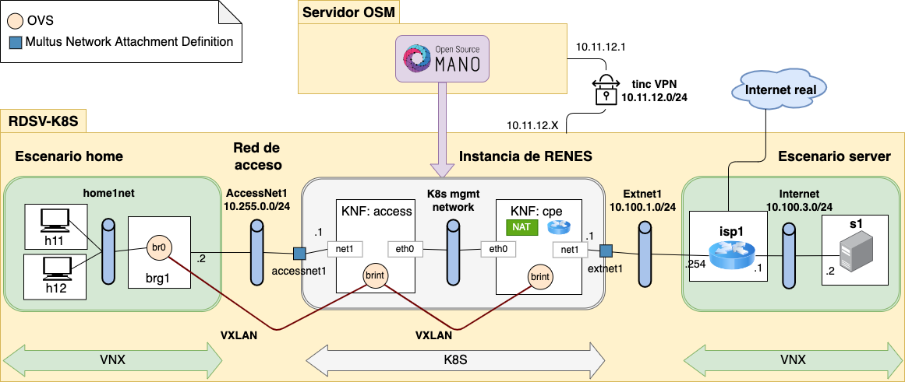

# nfv-lab
Repository for NFV lab with OSM MANO.
It contains a helm-repository, check out the [index.yaml](index.yaml)

## Scenario


## Quick testing guide
1. Launch the machines RDSV-OSM and RDSV-K8S
2. On both machines open a terminal, clone the repository and change to the folder nfv-lab:

```
cd Desktop
git clone https://github.com/educaredes/nfv-lab.git
cd nfv-lab
```

3. On RDSV-K8S, start the VNX scenarios

```
sudo vnx -f vnx/nfv3_home_lxc_ubuntu64.xml -t
sudo vnx -f vnx/nfv3_server_lxc_ubuntu64.xml -t
```

4. On RDSV-OSM, from the Desktop (graphically):

- start Firefox to access OSM at localhost (admin/admin)
- register a new k8s  repository using id: helmchartrepo, type: "Helm Chart" 
and URL https://educaredes.github.io/nfv-lab (DO NOT TERMINATE WITH "/")


5. On RDSV-OSM, from the Desktop (graphically):
- select the Package menu in OSM
- access the package folder nfv-lab/pck
- onboard the VNFs accessknf_vnfd.tar.gz and cpeknf_vnfd.tar.gz
- onboard the NS renes_ns.tar.gz

6. On RDSV-OSM, from the terminal instantiate the service renes1 and wait 
until it is completely instantiated:

```
osm ns-create --ns_name renes1 --nsd_name renes --vim_account dummy_vim
watch osm ns-list
```

Exit with ctrl+C


7. On RDSV-OSM launch the additional configuration:

```
export OSMNS=7b2950d8-f92b-4041-9a55-8d1837ad7b0a   #OSM namespace
./osm_renes1.sh
```
(alternatively, follow the [Alternative steps for testing](README-alt-6-9.md))

8. On RDSV-K8S, accesss the h11 terminal (root/xxxx) and check connectivity:

```
ifconfig eth1 # should have a 192.168.1.255.X/24 IP address
ping -c 5 8.8.8.8
firefox www.upm.es
```
