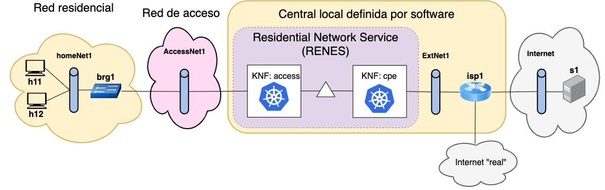
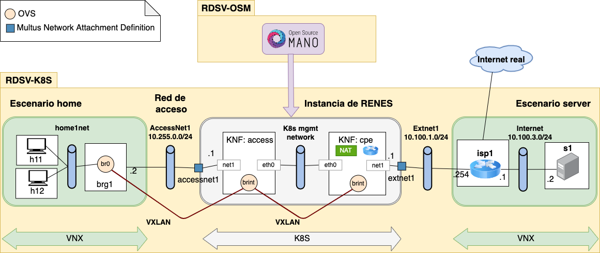
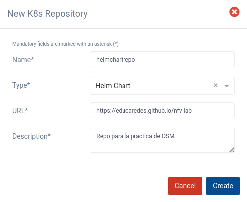

<!-- omit from toc -->
RDSV/SDNV P4 - Plataforma de orquestación de servicios basados en NFV
=====================================================================


- [Resumen](#resumen)
- [Escenario](#escenario)
- [Entrega de resultados](#entrega-de-resultados)
- [Desarrollo de la práctica](#desarrollo-de-la-práctica)
  - [1. Instalación del entorno](#1-instalación-del-entorno)
    - [1.1 Instalación y arranque de la máquina virtual en el laboratorio](#11-instalación-y-arranque-de-la-máquina-virtual-en-el-laboratorio)
    - [1.1.alt Instalación y arranque de la máquina virtual en equipo propio](#11alt-instalación-y-arranque-de-la-máquina-virtual-en-equipo-propio)
    - [1.2 Instalación del entorno en la máquina virtual](#12-instalación-del-entorno-en-la-máquina-virtual)
  - [2. Definición OSM del clúster k8s y configuración de red](#2-definición-osm-del-clúster-k8s-y-configuración-de-red)
  - [3. Familiarización con GUI de OSM](#3-familiarización-con-gui-de-osm)
  - [4. Repositorios de helm charts y docker](#4-repositorios-de-helm-charts-y-docker)
  - [5. (:question:) Relación entre helm y docker](#5-question-relación-entre-helm-y-docker)
  - [6. Instalación de descriptores en OSM](#6-instalación-de-descriptores-en-osm)
  - [7. (P) Análisis de descriptores](#7-p-análisis-de-descriptores)
  - [8. Arranque de escenarios VNX](#8-arranque-de-escenarios-vnx)
  - [9. Creación de instancias del servicio](#9-creación-de-instancias-del-servicio)
  - [10. Comprobación de los pods arrancados](#10-comprobación-de-los-pods-arrancados)
  - [11. (P) Acceso a los pods ya arrancados](#11-p-acceso-a-los-pods-ya-arrancados)
  - [12. (P) Scripts de configuración del servicio](#12-p-scripts-de-configuración-del-servicio)
  - [13. (P) Configuración del servicio](#13-p-configuración-del-servicio)
  - [14. (P) Servicio desde la red de acceso](#14-p-servicio-desde-la-red-de-acceso)
  - [15. (P) Análisis de tráfico en AccessNet1](#15-p-análisis-de-tráfico-en-accessnet1)
  - [16. (P) Análisis de tráfico en ExtNet1](#16-p-análisis-de-tráfico-en-extnet1)
  - [17. (P) Servicio para la segunda red residencial](#17-p-servicio-para-la-segunda-red-residencial)

## Resumen
En esta práctica, se va a utilizar la plataforma de código abierto [Open Source
MANO (OSM)](https://osm.etsi.org) para profundizar en la orquestación de
funciones de red virtualizadas. El escenario que se va a utilizar está inspirado
en la reconversión de las centrales locales a centros de datos que permiten,
entre otras cosas, reemplazar servicios de red ofrecidos mediante hardware
específico y propietario por servicios de red definidos por software sobre
hardware de propósito general. Las funciones de red que se despliegan en estas
centrales se gestionan mediante una plataforma de orquestación como OSM o XOS. 

El servicio de red objeto de estudio es el servicio residencial de acceso a
Internet. La  Fig. 1 ilustra las funciones que tradicionalmente realiza el
“router residencial” (Customer Premises Equipment – CPE) desplegado en casa del
usuario, como switch Ethernet / punto de acceso WiFi, servidor DHCP, traducción
de direcciones NAT y reenvío de datagramas IP. El objetivo de la práctica es
estudiar como esas funciones pasarán a realizarse en la central local. 


*Fig. 1. CPE tradicional*

Como se observa en la Fig. 2, el router residencial se sustituye por un equipo
que llamaremos “Bridged Residential Gateway (BRG)” que realiza la conmutación de
nivel 2 del tráfico de los usuarios entre la red residencial y la central local.
El resto de las funciones (DHCP, NAT y router para reenvío IP) se realizan en la
central local aplicando técnicas de virtualización de funciones de red (NFV),
creando un servicio de CPE virtual (vCPE) gestionado mediante la plataforma de
orquestación. 


*Fig. 2. CPE virtualizado*

## Escenario

La Fig. 3 muestra una visión global del escenario que se va a emular, con dos
sistemas finales h11 y h12 en casa del usuario, conectados al brg1 que, a través
de la red de acceso AccessNet se conecta a su vez a la central local, donde el
servicio de red residencial "RENES" (REsidential NEtwork Service) se va a
ofrecer a través de dos VNF implementadas mediante Kubernetes (KNF):

- Una KNF:access, que se conecta a la red de acceso y permitiría clasificar el
  tráfico e implementar QoS en el acceso del usuario a la red.
- Una KNF:vcpe, que integrará las funciones de servidor DHCP, NAT y reenvío de
  IP. 

El entorno utilizado para gestionar los servicios de red es OSM.



*Fig. 3. Visión global del escenario*

El escenario explicado se va a implementar para la práctica en una máquina Linux
en VirtualBox, **RDSV-K8S**, que permite emular las distintas redes y hosts del
escenario, y el cluster de Kubernetes (K8s) de la central local. Tiene
instaladas las herramientas:
- el paquete _microk8s_ para proporcionar la funcionalidad de k8s,
- la herramienta _VNX_, que se usará para emular los equipos de la red
  residencial, el router isp1 y el servidor s1,
- _Open vSwitch (ovs)_, que permitirá emular la red de acceso AccessNet1, la red
  externa ExtNet1 que da salida al router isp1, y que además se utiliza tanto en
  la emulación del bgr1 como en las KNFs.

Esas máquina tendrán conectividad con el servidor OSM instalado en la
infraestructura de laboratorios del DIT, a través de una red privada virtual
creada mediante la herramienta _tinc_. 

El detalle del escenario se puede ver en la Fig 4. 



*Fig. 4. Visión detallada del escenario*

Como se refleja en la figura, se utilizará la tecnología _VXLAN_ para enviar
encapsuladas en datagramas UDP las tramas de nivel 2 que viajan entre brg1,
KNF:access y KNF:cpe. Para permitir esta comunicación, tanto el brg1 como
KNF:access tendrán interfaces en AccessNet1, configuradas con direcciones IP del
prefijo 10.255.0.0/24. La asignación de direcciones IP a KNF:access y KNF:cpe en
la red que las interconecta está gestionada por OSM y k8s, de manera que se
asignan dinámicamente al instanciar las KNFs.

## Entrega de resultados

En los apartados siguientes encontrará algunos marcados con (P). Deberá 
responder a esos apartados en un documento memoria-p4.pdf.

Suba a través del Moodle un único fichero zip que incluya el fichero pdf y las
capturas que se solicitan.

## Desarrollo de la práctica
### 1. Instalación del entorno
#### 1.1 Instalación y arranque de la máquina virtual en el laboratorio
Se accederá a un PC del laboratorio,  _pc-k8s_ para el clúster de K8S. 

En _pc-k8s_, abra un terminal, cree un directorio `shared` y descargue allí el
repositorio de la práctica: 

```
mkdir -p ~/shared
cd ~/shared
git clone https://github.com/educaredes/nfv-lab.git
cd nfv-lab
```

A continuación, ejecute:

```
chmod +x bin/get-osmlab-k8s
bin/get-osmlab-k8s
```

El comando `bin/get-osmlab-k8s`:
- instala la ova que contiene la máquina virtual,
- añade el directorio compartido en la máquina virtual, en `/home/upm/shared`.
El objetivo es que esa carpeta compartida sea accesible tanto en el PC anfitrión
como en la máquina _RDSV-K8S_. 

#### 1.1.alt Instalación y arranque de la máquina virtual en equipo propio

Tras descargar e importar la ova, utilice la opción de configuración de
_Carpetas Compartidas_ para compartir una carpeta de su equipo con la máquina
virtual permanentemente, con punto de montaje `/home/upm/shared`. Asegúrese
además de configurar 4096 MB de memoria y 2 CPUs.

#### 1.2 Instalación del entorno en la máquina virtual

Arranque la máquina, por ejemplo por línea de comando:

```
vboxmanage startvm RDSV-K8S
``` 

En la máquina virtual, abra un terminal y descargue en el directorio compartido
el repositorio de la práctica: 

```
cd ~/shared
git clone https://github.com/educaredes/nfv-lab.git
cd nfv-lab
```

>**Nota:**
>Si ya lo ha descargado antes puede actualizarlo con:
>
>```
>cd ~/shared/nfv-lab
>git pull
>```

Instale el túnel hacia el servidor OSM mediante:

```
cd ~/bin
wget idefix.dit.upm.es/download/rdsv/tinc/install-tun
chmod +x install-tun
./install-tun <letra> <tinc-server>
```

donde `\<tinc-server\>` será:
- en caso de usar un PC del laboratorio, `labserver06.lab.dit.upm.es`
- en caso de conectarse desde un equipo personal propio, déjelo en blanco


>**Nota:**
>El profesor asignará una \<letra\> a cada alumno o grupo de alumnos, de forma
>que cada clúster de k8s gestionado por el OSM central tenga una dirección IP
>distinta.

Compruebe que se ha establecido el túnel haciendo ping al servidor OSM:

```
ping 10.11.12.1
```

### 2. Definición OSM del clúster k8s y configuración de red 


Configure desde un terminal las variables de entorno que el cliente de OSM
instalado en _RDSV-K8S_ acceda al servidor, así como un alias para el comando
`microk8s kubectl`:

```
echo "export OSM_USER=nombre-de-usuario" >> ~/.bashrc
echo "export OSM_PASSWORD=password-de-usuario" >> ~/.bashrc
echo "export OSM_PROJECT=proyecto-de-usuario" >> ~/.bashrc

echo "export OSM_HOSTNAME=10.11.12.1" >> ~/.bashrc
echo "alias kubectl='microk8s kubectl'" >> ~/.bashrc
source ~/.bashrc
```

Registre el clúster en OSM. Para ello obtenga la dirección de la mv en la red
10.11.12.0/24 del túnel mediante:


```
ifconfig | grep 10.11.12
```

Edite el fichero ~/k8s-cluster.yaml para sustituir su dirección IP por la del
túnel: use un editor y modifique la línea _server_ reemplazando la IP.

A continuación registre un vim _dummy_ y un clúster dependiente de ese vim con
los siguientes comandos:

```
osm vim-create --name dummy_vim --user u --password p --tenant p \
--account_type dummy --auth_url http://localhost/dummy

KID=$(osm k8scluster-add --creds ~/k8s-cluster.yaml --version 1.21 \
--vim dummy_vim --description "External k8s cluster" --k8s-nets \
'{"net1": "osm-ext"}' microk8s-cluster)
```

Y compruebe que se devuelve correctamente el identificador del clúster mediante:

```
echo $KID
```

> **Ejemplo:**
> 
>```
>~$ echo $KID
>68945185-1051-4cc0-8b1e-26382fc729e7
>```

Obtenga la información registrada en OSM para el clúster:

```
osm k8scluster-show $KID
```

En el resultado del show, busque la información sobre el `namespace` que va
a utilizar OSM en el clúster para desplegar los pods de los servicios de red. 
Puede utilizar:

```
osm k8scluster-show --literal $KID | grep -A1 projects

```

> **Ejemplo:**
> 
>```
>~$ osm k8scluster-show --literal $KID | grep -A1 projects
>projects_read:
>- 66ad98eb-bc56-48a9-96c8-8d14c612931c
>projects_write:
>- 66ad98eb-bc56-48a9-96c8-8d14c612931c
>```

Defina una variable para guardar ese valor, que se utilizará en los scripts 
de la práctica.

```
export OSMNS=<namespace> # todo seguido, sin espacios y sin < >
```

> **Ejemplo:**
> 
>```
>export OSMNS=66ad98eb-bc56-48a9-96c8-8d14c612931c
>```

Compruebe si el namespace existe con:

```
kubectl get namespaces
```

Si no existe cree el namespace en el clúster de k8s
(esto lo hace OSM la primera vez que se instancia un servicios, pero en nuestro
caso lo creamos antes para poder hacer la configuración del siguiente paso):

```
kubectl create namespace $OSMNS 
```

Y use de nuevo el comando _get namespaces_ para comprobar si se ha creado. 


A continuación, para conectar el namespace con los escenarios de VNX se deben
crear 2 Network Attachment Definitions de _Multus_ asociados a ese namespace,
ejecutando los comandos:

```
cat <<EOF | kubectl create -n $OSMNS -f -
apiVersion: "k8s.cni.cncf.io/v1"
kind: NetworkAttachmentDefinition
metadata:
 name: extnet1
 annotations:
   k8s.v1.cni.cncf.io/resourceName: ovs-cni.network.kubevirt.io/ExtNet1
spec:
 config: '{
   "cniVersion": "0.3.1",
   "type": "ovs",
   "bridge": "ExtNet1"
 }'
EOF

cat <<EOF | kubectl create -n $OSMNS -f -
apiVersion: "k8s.cni.cncf.io/v1"
kind: NetworkAttachmentDefinition
metadata:
 name: accessnet1
 annotations:
   k8s.v1.cni.cncf.io/resourceName: ovs-cni.network.kubevirt.io/AccessNet1
spec:
 config: '{
   "cniVersion": "0.3.1",
   "type": "ovs",
   "bridge": "AccessNet1"
 }'
EOF

```

Compruebe que se han creado con 

```
kubectl get -n $OSMNS network-attachment-definitions
```

> **Ejemplo:**
>
>```
>~> kubectl get -n $OSMNS network-attachment-definitions
>NAME         AGE
>extnet1      90s
>accessnet1   88s
>```

Y los detalles, con 

```
kubectl get -n $OSMNS network-attachment-definition extnet1 -o yaml
kubectl get -n $OSMNS network-attachment-definition accessnet1 -o yaml
```


### 3. Familiarización con GUI de OSM

Desde el _PC anfitrión_, acceda a la interfaz gráfica de _OSM_ a través de
http://osm.dit.upm.es

Compruebe que también puede acceder desde la máquina virtual mediante:

```
# Acceso desde la máquina virtual
firefox 10.11.12.1 &
```

Familiarícese con las distintas opciones del menú, especialmente:
- _Packages_: gestión de las plantillas de servicios de red (NS Packages)
y VNFs. 
- _Instances_: gestión de la instancias de los servicios desplegados
- _K8s_: gestión del registro de clústeres y repositorios k8s

### 4. Repositorios de helm charts y docker

A través de la GUI registraremos el repositorio de helm charts que 
utilizaremos en la práctica, alojado en Github Pages.

Acceda a la opción de menú _K8s Repos_, haga clic sobre el botón
 _Add K8s Repository_ y rellene los campos con los valores:
- id: `helmchartrepo`
- type: "Helm Chart" 
- URL: `https://educaredes.github.io/nfv-lab` (NO DEBE TERMINAR EN "/")
- description: _una descripción textual del repositorio_



En la carpeta compartida `$HOME/shared/nfv-lab/helm` puede encontrar las
definiciones de los helm charts `accesschart` y `cpechart`, mientras que en
`$HOME/shared/nfv-lab/img` está la definición del contenedor docker único que se
va a utilizar, `educaredes/vnf-img`. Este contenedor está alojado en DockerHub,
compruébelo accediendo a [este enlace](https://hub.docker.com/u/educaredes).

### 5. (:question:) Relación entre helm y docker

Busque en la carpeta `helm` en qué ficheros se hace referencia al contenedor
docker. Anote el resultado para incluirlo como parte de la entrega. Puede 
utilizar:

```
grep -R "educaredes/vnf-img"
```

### 6. Instalación de descriptores en OSM

Desde el _PC anfitrión_, acceda gráficamente al directorio 
`$HOME/shared/nfv-lab/pck`. Realice el proceso de instalación de los 
descriptores de las KNFs y del servicio de red (onboarding):
- Acceda al menu de OSM Packages->VNF packages y arrastre los ficheros 
`accessknf_vnfd.tar.gz` y `cpeknf_vnfd.tar.gz`   
- Acceda al menu de OSM Packages->NS packages y arrastre el fichero 
`renes_ns.tar.gz`

### 7. (P) Análisis de descriptores

Acceda a la descripción de las VNFs/KNFs y del servicio. Para entregar como 
resultado de la práctica:
1.	En la descripción de las VNFs, identifique y copie la información referente
al helm chart que se utiliza para desplegar el pod correspondiente en el clúster
de Kubernetes.
2.	En la descripción del servicio, identifique y copie la información 
referente a las dos VNFs.

### 8. Arranque de escenarios VNX 

Acceda a _RDSV-K8S_ y compruebe que están creados los switches `AccessNet1` y
`ExtNet1` tecleando en un terminal:

```
sudo ovs-vsctl show
```

A continuación arranque el escenario de la red residencial:

```
cd /home/upm/shared/nfv-lab
sudo vnx -f vnx/nfv3_home_lxc_ubuntu64.xml -t
```

El escenario contiene dos redes residenciales, nos centraremos inicialmente en
la primera de ellas (sistemas finales h11 y h12). Compruebe en los terminales
de los hosts h11 y h12 que no tienen asignada dirección IP en la interfaz 
`eth1` mediante:

```
ifconfig eth1
```

> **Nota:**
> Los hosts tienen configurada la red de gestión VNX en la interfaz `eth0`.

Compruebe también que el cliente DHCP no les permite obtener dirección IP y que
no tienen acceso a Internet:

```
dhclient eth1
ifconfig
ping 8.8.8.8
```

Arranque también el escenario "server"

```
sudo vnx -f vnx/nfv3_server_lxc_ubuntu64.xml -t
```

Finalmente, para permitir el acceso a aplicaciones con entorno gráfico desde las
máquinas arrancadas con VNX ejecute:

```
xhost +
```

> **Nota:**
> Mostrará como salida:
>
>```
>access control disabled, clients can connect from any host
>```

### 9. Creación de instancias del servicio

Desde el terminal lanzamos los siguientes comandos:

```
export NSID1=$(osm ns-create --ns_name renes1 --nsd_name renes --vim_account dummy_vim)
echo $NSID1
```

Mediante el comando `watch` visualizaremos el estado de la instancia del 
servicio, que hemos denominado `renes1`. 

```
watch osm ns-list
```

Espere a que alcance el estado _READY_ y salga con `Ctrl+C`.

Si se produce algún error, puede borrar la instancia del servicio con el 
comando:

```
osm ns-delete $NSID1
```

Y a continuación lanzar de nuevo la creación de una nueva instancia.

Acceda a la GUI de OSM, opción NS Instances, para ver cómo también es posible
gestionar el servicio gráficamente.

### 10. Comprobación de los pods arrancados

Usaremos kubectl para obtener los pods que han arrancado en el clúster:

```
kubectl -n $OSMNS get pods
```

A continuación, defina dos variables:

```
ACCPOD=<nombre del pod de la KNF:access>
CPEPOD=<nombre del pod de la KNF:cpe>
```

### 11. (P) Acceso a los pods ya arrancados

Haga una captura del texto o captura de pantalla del resultado de los 
siguientes comandos y explique dicho resultado. ¿Qué red están utilizando 
los pods para esa comunicación?

```
kubectl -n $OSMNS exec -it $ACCPOD -- ifconfig eth0
# anote la dirección IP

kubectl -n $OSMNS exec -it $CPEPOD -- /bin/bash
# Y a continuación haga un ping a la dirección IP anotada
# Salga con exit
```

### 12. (P) Scripts de configuración del servicio

Desde el _PC anfitrión_ acceda (mediante vi, nano, gedit, ...) al contenido 
del fichero `osm_renes1.sh` utilizado para configurar la instancia renes1 del
servicio. Compare los valores utilizados con los de la figura detallada del 
escenario. Indique cuál es la dirección IP "pública" (en realidad es de un 
rango privado), que deberá usar la función NAT del CPE para dar salida al 
tráfico de la red residencial hacia Internet. 

> **Parte opcional, para hacer tras la sesión del laboratorio:** 
> Analice y describa para qué se utilizan los scripts `osm_renes_start.sh` y 
`renes_start.sh`.

### 13. (P) Configuración del servicio

Desde _RDSV-K8S_, configure el servicio renes1 mediante `osm_renes1.sh`:

```
./osm_renes1.sh
```

Analice a continuación el detalle del escenario en la Fig. 4 e indique 
qué comando(s) puede utilizar **desde _RDSV-K8S_** para comprobar si hay 
conectividad entre el servicio desplegado y el dispositivo `brg1` de la 
red residencial. Verifique que haya conectividad. 

### 14. (P) Servicio desde la red de acceso

Compruebe la configuración de red de h11 y h12 y, si no han obtenido dirección 
IP, fuerce el acceso al servidor DHCP mediante el comando:

```
dhclient eth1
```

Indique qué direcciones IP obtienen h11 y h12 en la red residencial “privada”, 
así como la dirección IP del router.

Relacione el resultado con los ficheros de configuración del contenedor docker 
`educaredes/vnf-img` incluidos en el directorio 
`$HOME/shared/nfv-lab/img/vnf-img`.

### 15. (P) Análisis de tráfico en AccessNet1

Desde _RDSV-K8S_, arranque wireshark y póngalo a capturar el tráfico en
`AccessNet1`, usando:

```
wireshark -ki brg1-e2 &
```

Desde h11 realice un ping de 5 paquetes a la dirección IP de su router, 
comprobando que funciona correctamente.

```
ping -c 5 <dir_IP_router>
```

Detenga wireshark, y guarde la captura con nombre “access1.pcapng”. Analice 
el tráfico capturado, justificando las direcciones IP que aparecen en los 
paquetes capturados.

### 16. (P) Análisis de tráfico en ExtNet1

Arranque wireshark y póngalo a capturar el tráfico en ExtNet, por ejemplo 
haciendo:

```
wireshark -ki isp1-e1 &
```

Desde h11 realice un ping de 5 paquetes a la dirección IP de s1 (10.100.3.2), 
comprobando que funciona correctamente.

```
ping -c 5 10.100.3.2
```

Detenga wireshark, y guarde la captura con nombre “ext1.pcapng”. Analice el 
tráfico capturado, justificando las direcciones IP que aparecen en 
los paquetes capturados.

Desde la consola de h11, compruebe que tiene acceso a Internet. Además de usar 
ping, puede arrancar un navegador.

```
ping -c 5 8.8.8.8
firefox www.dit.upm.es &
```

### 17. (P) Servicio para la segunda red residencial

Indique y realice los pasos necesarios para dar acceso a Internet a la 
segunda red residencial (h21, h22). Para la configuración del servicio, 
tome como punto de partida `osm_renes1.sh` y cree un nuevo script
`osm_renes2.sh`. 

Compruebe que los pasos dados funcionan correctamente:
- compruebe que h21 y h22 obtienen acceso a Internet
- compruebe que a su vez sigue funcionando la primera red residencial (h11, h12)
- indique qué direcciones IP han obtenido h21 y h22

Incluya además el contenido de `osm_renes2.sh` en la memoria de respuestas.


