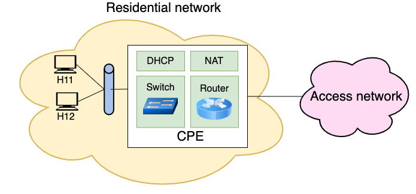
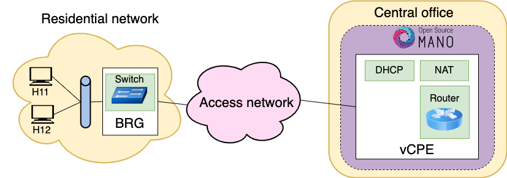

# RDSV/SDNV P4 - NFV Management and Orchestration

- [RDSV/SDNV P4 - NFV Management and Orchestration](#rdsvsdnv-p4---nfv-management-and-orchestration)
  - [Summary](#summary)
  - [Scenario](#scenario)
  - [Delivery of results](#delivery-of-results)
  - [Development of the practice](#development-of-the-practice)
    - [1. Setting up the environment](#1-setting-up-the-environment)
      - [1.1. Installing and booting the virtual machine on your own machine](#11-installing-and-booting-the-virtual-machine-on-your-own-machine)
      - [1.2 Installing the environment in the virtual machine](#12-installing-the-environment-in-the-virtual-machine)
    - [2. OSM definition of the k8s cluster and network configuration](#2-osm-definition-of-the-k8s-cluster-and-network-configuration)
    - [3. Familiarisation with OSM GUI](#3-familiarisation-with-osm-gui)
    - [4. Helm charts and docker repositories](#4-helm-charts-and-docker-repositories)
    - [5. (P) Relationship between helm and docker](#5-p-relationship-between-helm-and-docker)
    - [6. Installation of descriptors in OSM](#6-installation-of-descriptors-in-osm)
    - [7. (P) Descriptor analysis](#7-p-descriptor-analysis)
    - [8. Starting VNX scenarios](#8-starting-vnx-scenarios)
    - [9. Creation of service instances](#9-creation-of-service-instances)
    - [10. Checking k8s pods](#10-checking-k8s-pods)
    - [11. (P) Access to pods](#11-p-access-to-pods)
    - [12. (P) Service configuration scripts](#12-p-service-configuration-scripts)
    - [13. (P) Service configuration](#13-p-service-configuration)
    - [14. (P) Service from the access network](#14-p-service-from-the-access-network)
    - [15. (P) Traffic analysis on `AccessNet1`](#15-p-traffic-analysis-on-accessnet1)
    - [16. (P) `ExtNet1` traffic analysis](#16-p-extnet1-traffic-analysis)
    - [17. (P) Service for the second residential network](#17-p-service-for-the-second-residential-network)

## Summary
In this lab, the [Open Source MANO (OSM)](https://osm.etsi.org) platform will be
used to delve deeper in the management and orchestration of virtualised network
functions. The scenario to be used is inspired by the conversion of local
exchanges into data centres that allow, among other things, to replace network
services offered by specific and proprietary hardware with software-defined
network services running on general-purpose hardware. The network functions
deployed in these exchanges are managed by an orchestration platform such as OSM
or XOS.

The network service under study is the residential Internet access service. Fig.
1 illustrates the functions traditionally performed by the "residential router"
(Customer Premises Equipment - CPE) deployed at the user's home, such as
Ethernet switch / WiFi access point, DHCP server, NAT address translation and IP
datagram forwarding. The objective of the practice is to study how these
functions will be implemented in the local exchange.



*Fig. 1. Traditional CPE*

As shown in Fig. 2, the residential router is replaced by a Bridged Residential
Gateway (BRG) that performs the layer 2 switching of user traffic between the
residential network and the local exchange. The rest of the functions (DHCP, NAT
and IP forwarding router) are performed in the local exchange by applying
network function virtualisation (NFV) techniques, creating a virtual CPE service
(vCPE) managed by the orchestration platform.



*Fig. 2. Virtualised CPE*

## Scenario

Fig. 3 shows an overview of the scenario to be emulated, with two end systems
h11 and h12 at the user's home, connected to brg1 which, through the AccessNet
access network, is connected to the local exchange, where the residential
network service "RENES" (REsidential NEtwork Service) will be offered through
two VNFs implemented through Kubernetes (KNF):

- KNF:access, which connects to the access network and would allow traffic classification and implement QoS on user access to the network.
- KNF:vcpe, which will integrate DHCP server, NAT and IP forwarding functions. 

The environment used to manage network services is OSM.


*Fig. 3. Overview of the scenario*

The explained scenario is going to be implemented for the practice on a Linux
machine VirtualBox, **RDSV-K8S**, which allows to emulate the different networks
and hosts of the scenario, and the Kubernetes cluster (K8s) of the local central
scenario, and the Kubernetes cluster (K8s) of the local exchange. It has the
following tools installed:

- the _microk8s_ package to provide k8s functionality,
- the _VNX_ tool, which will be used to emulate the home network equipment, the
  isp1 router and the s1 server. residential network, the isp1 router and the s1
  server,
- _Open vSwitch (ovs)_, which will be used to emulate the AccessNet1 access
  network, the external ExtNet1 network that ExtNet1 external network that
  outputs to the isp1 router, and which is also used in both the bgr1 emulation
  and the isp1 router emulation. bgr1 emulation as well as in the KNFs.

These machines will have connectivity with the OSM server installed in DIT's laboratory
DIT's laboratory infrastructure, through a virtual private network created by
created using the _tinc_ tool. 

The detail of the scenario can be seen in Fig 4. 


*Fig 4. Detailed view of the scenario*

As shown in the figure, _VXLAN_ technology will be used to send layer 2 frames
encapsulated in UDP datagrams travelling between brg1, KNF:access and KNF:cpe.
To enable this communication, both brg1 and KNF:access will have interfaces on
Access. KNF:access will have interfaces on AccessNet1, configured with IP
addresses of the prefix 10.255.0.0.0. prefix 10.255.0.0/24. The assignment of IP
addresses to KNF:access and KNF:cpe on the interconnecting network is the
network that interconnects them is managed by OSM and k8s, so that they are
dynamically dynamically assigned when the KNFs are instantiated.

## Delivery of results

In the following sections you will find some marked with (P). You will have to
respond to these items in a document memo-p4.pdf.

Upload a single zip file including the pdf file and the requested screenshots to
the  Moodle task created for this.


## Development of the practice
### 1. Setting up the environment
#### 1.1. Installing and booting the virtual machine on your own machine

After downloading and importing the ova, use the _Shared Folders_ configuration
option to **permanently** share a folder on your computer with the virtual machine ,
with mount point `/home/upm/shared`. Also make sure to configure 4096 MB of
memory and 2 CPUs.

#### 1.2 Installing the environment in the virtual machine

Boot the machine, e.g. via the command line:

```
vboxmanage startvm RDSV-K8S
``` 

In the virtual machine, open a terminal and download the practice repository
into the shared directory:

```
cd ~/shared
git clone https://github.com/educaredes/nfv-lab.git
cd nfv-lab
```

>**Note:**
>If you have already downloaded it before, you can update it with:
>
>```
>cd ~/shared/nfv-lab
>git pull
>```

Install the tunnel to the OSM server via:

```
cd ~/shared/nfv-lab/bin
./install-tun <letter> <tinc-server>
```

where  `\<tinc-server\>` shall be:
- in case of using a PC from the DIT labs, `labserver06.lab.dit.upm.es`
- if connecting from your own personal computer, leave blank


>**Note:** The teacher will assign a \<letter\> to each student or group of
>students, so that each cluster of k8s managed by the central OSM has a
>different IP address.


Verify that the tunnel has been established by pinging the OSM server:

```
ping 10.11.12.1
```

### 2. OSM definition of the k8s cluster and network configuration

Configure the environment to access OSM with your username and to register your
k8s cluster with the following:

```
cd ~/shared/nfv-lab/bin
./prepare-osmlab <letter> 
```

Then, **exit the terminal** and open a new one.

On the new terminal, check the values of the different variables set for 
accessing OSM (OSM_*) and the id of the K8S namespace created for OSM (OSMNS):

```
echo "-- OSM_USER=$OSM_USER"
echo "-- OSM_PASSWORD=$OSM_PASSWORD"
echo "-- OSM_PROJECT=$OSM_PROJECT"
echo "-- OSM_HOSTNAME=$OSM_HOSTNAME"
echo "-- OSMNS=$OSMNS"
```

### 3. Familiarisation with OSM GUI

From the _host PC_, access the _OSM_ GUI via http://osm.dit.upm.es.

Check that you can also access from the virtual machine via:

```
# Acceso desde la máquina virtual
firefox 10.11.12.1 &
```

Familiarise yourself with the different menu options, especially:
- _Packages_: management of network service templates (NS Packages) and VNFs.
- _Instances_: management of instances of deployed services.
- _K8s_: k8s repository and cluster registry management.

### 4. Helm charts and docker repositories

Through the GUI we will register the helm charts repository that we will use in
practice, hosted in Github Pages.

Go to the menu option _K8s Repos_, click on the _Add K8s Repository_ button and
fill in the fields with the values:

- id: `helmchartrepo`
- type: "Helm Chart" 
- URL: `https://educaredes.github.io/nfv-lab` (MUST NOT END IN "/")
- description: _a textual description of the repository_


In the shared folder `$HOME/shared/nfv-lab/helm` you can find the definitions of
the helm charts `accesschart` and `cpechart`, while in
`$HOME/shared/nfv-lab/img` is the definition of the single docker container to
be used, `educaredes/vnf-img`. This container is hosted on DockerHub, you can
check it out by accessing  [this link](https://hub.docker.com/u/educaredes).

### 5. (P) Relationship between helm and docker

Search the `helm` folder for the files in which the docker container is
referenced. Make a note of the result to include it as part of the deliverable.
You can use:

```
grep -R "educaredes/vnf-img"
```

### 6. Installation of descriptors in OSM

From the _host PC_, graphically access the `$HOME/shared/nfv-lab/pck` directory.
Perform the installation process of the KNFs and network service descriptors
(onboarding):

- Go to the OSM Packages->VNF packages menu and drag the files
  `accessknf_vnfd.tar.gz` and `cpeknf_vnfd.tar.gz`.
- Go to OSM Packages->NS packages menu and drag the file `renes_ns.tar.gz`


### 7. (P) Descriptor analysis

Access the description of the VNFs/KNFs and the service. To be delivered as a
result of the practice:

1. In the description of the VNFs, identify and copy the information regarding
   the helm chart that is used to deploy the corresponding pod in the Kubernetes
   cluster.
2. In the service description, identify and copy the information regarding the
   two VNFs.


### 8. Starting VNX scenarios 

Access _RDSV-K8S_ and verify that the `AccessNet1` and `ExtNet1` switches are
created by typing on a terminal:

```
sudo ovs-vsctl show
```

Then start the residential network scenario:

```
cd /home/upm/shared/nfv-lab
sudo vnx -f vnx/nfv3_home_lxc_ubuntu64.xml -t
```

> **Note:**
> To access any of the  virtual machines started with VNX,
> _user/password : root/xxxx_ 

The scenario contains two residential networks, we will initially focus on the
first one (end systems h11 and h12). Check on the terminals of hosts h11 and h12
that they have no IP address assigned on the `eth1`
interface via:

```
ifconfig eth1
```

> **Note:**
> Hosts have a VNX management network configured on the `eth0` interface. 

Also check that the DHCP client does not allow them to obtain IP address and
that they do not have access to the Internet:

```
dhclient eth1
ifconfig
ping 8.8.8.8
```

Start the "server" scenario

```
sudo vnx -f vnx/nfv3_server_lxc_ubuntu64.xml -t
```

Finally, to allow access to graphical environment applications from VNX-booted machines, run:

```
xhost +
```

> **Note:**
> It will show the following output:
>
>```
>access control disabled, clients can connect from any host
>```

### 9. Creation of service instances

From the terminal we launch the following commands:

```
export NSID1=$(osm ns-create --ns_name renes1 --nsd_name renes --vim_account dummy_vim)
echo $NSID1
```

We will use the `watch` command to display the status of the service instance,
which we have named `renes1`.

```
watch osm ns-list
```

Wait until it reaches _READY_ status and exit with `Ctrl+C`.

If an error occurs, you can delete the service instance with the command:


```
osm ns-delete $NSID1
```

And then launch the creation of a new instance again.

Access the OSM GUI, option NS Instances, to see how it is also possible to
manage the service graphically.


### 10. Checking k8s pods

We will use `kubectl` to get the pods that have started in the cluster:

```
kubectl -n $OSMNS get pods
```

Next, define two variables:

```
ACCPOD=<nombre del pod de la KNF:access>
CPEPOD=<nombre del pod de la KNF:cpe>
```

### 11. (P) Access to pods

Take a text capture or screenshot of the result of the following commands and
explain the result. Which network are the pods using for this communication?

```
kubectl -n $OSMNS exec -it $ACCPOD -- ifconfig eth0
# write down the IP address

kubectl -n $OSMNS exec -it $CPEPOD -- /bin/bash
# And then ping the IP address obtained above
# Use the command 'exit' when finished
```

### 12. (P) Service configuration scripts

From the _host PC_ (via vi, nano, gedit, ...) access the contents of the
`osm_renes1.sh` file used to configure the renes1 instance of the service.
Compare the values used with those in the detailed figure of the scenario.
Indicate which is the "public" IP address (actually it is an IP address from a
private range), to be used by the NAT function of the CPE to output traffic from
the home network to the Internet.

> **Optional part, to be done after the lab session:** Discuss and describe what
> the `osm_renes_start.sh` and `renes_start.sh` scripts are used for.

### 13. (P) Service configuration

From _RDSV-K8S_, configure the renes1 service using `osm_renes1.sh`:

```
./osm_renes1.sh
```

Then, discuss the scenario in Fig. 4 and propose the command(s) you could use
**from _RDSV-K8S_** to check if there is connectivity between the deployed
service and the `brg1` device in the residential network. Verify that there is
connectivity.

### 14. (P) Service from the access network

Check the network configuration of h11 and h12 and, if they have not obtained an IP address, force the access to the DHCP server using the command:

```
dhclient eth1
```

Include as part of the results the IP addresses obtained in the "private"
residential network by h11 and h12, as well as the IP address of the router.

Discuss the relationship of the above results to the docker container
configuration files `educaredes/vnf-img` included in the
`$HOME/shared/nfv-lab/img/vnf-img` directory.

### 15. (P) Traffic analysis on `AccessNet1`

From _RDSV-K8S_, start wireshark and set it to capture traffic on `AccessNet1`,
using:

```
wireshark -ki brg1-e2 &
```

From h11 start a ping with 5 packets to the IP address of your router, checking
that it is working correctly.

```
ping -c 5 <dir_IP_router>
```

Stop wireshark, and save the capture as "access1.pcapng". Analyse the captured
traffic, justifying the IP addresses that appear in the captured packets.

### 16. (P) `ExtNet1` traffic analysis

Start wireshark and set it to capture traffic on ExtNet, for example by doing:

```
wireshark -ki isp1-e1 &
```

From h11 start a ping with 5 packets to the IP address of s1 (10.100.3.2),
verifying that it works correctly.

```
ping -c 5 10.100.3.2
```

Stop wireshark, and save the capture as "ext1.pcapng". Analyse the captured
traffic, justifying the IP addresses that appear in the captured packets.

From the h11 terminal, check that you have access to the Internet. In addition
to using ping, you can start a browser.


```
ping -c 5 8.8.8.8
firefox www.dit.upm.es &
```

### 17. (P) Service for the second residential network

Specify and perform the necessary steps to give Internet access to the second
home network (h21, h22). For service configuration, take `osm_renes1.sh` as a
starting point and create a new `osm_renes2.sh` script.

Check that the above steps are working correctly:
- check that h21 and h22 get access to the internet.
- check that the first residential network (h11, h12) is still operating.
- indicate which IP addresses have been obtained by h21 and h22.

Also include the contents of  `osm_renes2.sh` as part of the results.


