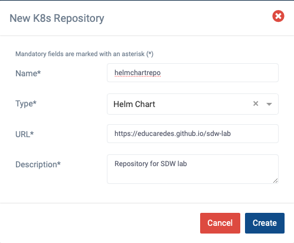

<!-- omit from toc -->
SDW Caso práctico 2: Plataforma de orquestación de servicios basados en NFV
===========================================================================

- [Resumen](#resumen)
- [Entorno](#entorno)
- [Desarrollo de la práctica](#desarrollo-de-la-práctica)
  - [1. Instalación del entorno](#1-instalación-del-entorno)
  - [2. Definición OSM del clúster k8s y configuración de red](#2-definición-osm-del-clúster-k8s-y-configuración-de-red)
  - [3. Familiarización con la GUI de OSM](#3-familiarización-con-la-gui-de-osm)
  - [4. (P) Repositorio de helm charts](#4-p-repositorio-de-helm-charts)
  - [5. Instalación de descriptores en OSM](#5-instalación-de-descriptores-en-osm)
  - [6. (P) Análisis de descriptores](#6-p-análisis-de-descriptores)
  - [7. Creación de instancias del servicio](#7-creación-de-instancias-del-servicio)
  - [8. Comprobación de los pods arrancados](#8-comprobación-de-los-pods-arrancados)
  - [9. (P) Acceso a los pods ya arrancados](#9-p-acceso-a-los-pods-ya-arrancados)
- [Anexo I - Comandos](#anexo-i---comandos)

# Resumen

En esta práctica, se va a profundizar en las funciones de red virtualizadas
(VNF) y su orquestación a través de la plataforma de código abierto [Open Source
MANO (OSM)](https://osm.etsi.org). Se va a ver cómo se despliegan funciones de
red virtualizadas mediante OSM a través de ejemplos que permitan entender
distintos procesos, como la creación de VNFs, la preparación de las plantillas
para VNFs y servicios de red y la carga (_onboarding_) de los servicios de red y
sus VNFs en este tipo de plataformas NFV.

# Entorno

Para facilitar la tarea del estudiante, se utilizará la misma máquina virtual
VirtualBox de la anterior actividad práctica, en la que ya está instalado y
configurado todo el software necesario, por lo que no es necesario volver a
descargarla. La máquina ya tiene instaladas todas las herramientas necesarias,
principalmente:

El escenario explicado se va a implementar para la práctica en una máquina Linux
en VirtualBox, **RDSV-K8S**, que permite emular las distintas redes y hosts del
escenario, y el cluster de Kubernetes (K8s) de la central local. Tiene
instaladas las herramientas:
- la infraestructura de NFV (NFVI) que va a ser controlada por OSM, implementada
  mediante el paquete _microk8s_, que proporcionará la funcionalidad de un
  clúster de Kubernetes (k8s),
- scripts en la carpeta ~/bin para facilitar la gestión del entorno

Esta máquina tendrá conectividad con un servidor OSM instalado en la
infraestructura de laboratorios del DIT, a través de una red privada virtual
creada mediante la herramienta _tinc_. 

# Desarrollo de la práctica
## 1. Instalación del entorno

Para realizar la práctica debe utilizar la misma máquina virtual de la práctica 
anterior. Antes de arrancar la máquina, utilice la opción de configuración de
_Carpetas Compartidas_ para compartir una carpeta de su equipo con la máquina
virtual permanentemente, con punto de montaje `/home/upm/shared`. Asegúrese
además de configurar 4096 MB de memoria y 2 CPUs. 

A continuación, arranque la máquina,  abra un terminal y descargue en el
directorio compartido el repositorio de la práctica: 

```
cd ~/shared
git clone https://github.com/educaredes/sdw-lab.git
cd sdw-lab
```

>**Nota:**
>Si ya lo ha descargado antes puede actualizarlo con:
>
>```
>cd ~/shared/sdw-lab
>git pull
>```

Instale la red privada virtual con el servidor OSM mediante:

```
cd ~/shared/sdw-lab/bin
./install-tun <letra>
```

>**Nota:**
>El profesor asignará una \<letra\> a cada alumno de forma
>que cada clúster de k8s gestionado por el OSM central tenga una dirección IP
>distinta.

Compruebe que se ha establecido el túnel haciendo ping al servidor OSM:

```
ping 10.11.12.1
```

## 2. Definición OSM del clúster k8s y configuración de red 

Configure el entorno para acceder a OSM con su nombre de usuario y para
registrar su cluster k8s mediante:

```
cd ~/shared/sdw-lab/bin
./prepare-osmlab <letter> 
```

A continuación, **cierre el terminal** y abra uno nuevo.

En el nuevo terminal, obtenga los valores asignados a las diferentes variables
configuradas para acceder a OSM (OSM_*) y el identificador del _namespace_ de
K8S creado para OSM (OSMNS):

```
echo "-- OSM_USER=$OSM_USER"
echo "-- OSM_PASSWORD=$OSM_PASSWORD"
echo "-- OSM_PROJECT=$OSM_PROJECT"
echo "-- OSM_HOSTNAME=$OSM_HOSTNAME"
echo "-- OSMNS=$OSMNS"
```

## 3. Familiarización con la GUI de OSM

Acceda a OSM desde la máquina virtual mediante:

```
# Acceso a OSM desde la máquina virtual
firefox 10.11.12.1 &
```

Familiarícese con las distintas opciones del menú, especialmente:
- _Packages_: gestión de las plantillas de servicios de red (NS Packages)
y VNFs. 
- _Instances_: gestión de la instancias de los servicios desplegados
- _K8s_: gestión del registro de clústeres y repositorios k8s

## 4. (P) Repositorio de helm charts

Para implementar las funciones de red virtualizadas se usarán _helm charts_, que
empaquetan todos los recursos necesarios para el despliegue de una aplicación en
un clúster de K8S. A través de la GUI registraremos el repositorio de _helm
charts_ que utilizaremos en la práctica, alojado en Github Pages.

Acceda a la opción de menú _K8s Repos_, haga clic sobre el botón
 _Add K8s Repository_ y rellene los campos con los valores:
- id: `helmchartrepo`
- type: "Helm Chart" 
- URL: `https://educaredes.github.io/sdw-lab` (NO DEBE TERMINAR EN "/")
- description: _una descripción textual del repositorio_



En la carpeta compartida `$HOME/shared/sdw-lab/helm` puede encontrar la
definición de los _helm charts_ `pingchart` y `pongchart` que se usarán en esta
práctica.


## 5. Instalación de descriptores en OSM

Desde el _PC anfitrión_, acceda gráficamente al directorio 
`$HOME/shared/sdw-lab/pck`. Realice el proceso de instalación de los 
descriptores de KNFs y del servicio de red (onboarding):
- Acceda al menu de OSM Packages->VNF packages y arrastre los ficheros
`pingknf_vnfd.tar.gz` y `pongknf_vnfd.tar.gz`. 
- Acceda al menu de OSM Packages->NS packages y arrastre el fichero 
`pingpong_ns.tar.gz`

Alternativamente, puede utilizar la línea de comandos:

```
osm vnfd-create $HOME/shared/sdw-lab/pck/pingknf_vnfd.tar.gz
osm vnfd-create $HOME/shared/sdw-lab/pck/pongknf_vnfd.tar.gz
osm nsd-create $HOME/shared/sdw-p2/pck/pingpong_nsd.tar.gz
```

## 6. (P) Análisis de descriptores

Acceda a continuación a la descripción de las VNFs y del servicio, tanto su
representación textual (botón “Edit”) como gráfica (botón “Show graph”).
Identifique en el texto la definición de cada elemento que se ve en la
representación gráfica. Compruebe también que los ficheros tar.gz que se han
usado para realizar el registro contienen precisamente una la representación
textual de la definición en formato YAML. Para entregar como resultado de la
práctica:

1.	En la descripción de las VNFs, identifique y copie la información referente
al helm chart que se utiliza para desplegar el pod correspondiente en el clúster
de Kubernetes.

2.	En la descripción del servicio, identifique y copie la información 
referente a las VNFs definidas.

## 7. Creación de instancias del servicio

Desde el terminal lanzamos los siguientes comandos:

```
export NSID1=$(osm ns-create --ns_name pingpong1 --nsd_name pingpong --vim_account dummy_vim)
echo $NSID1
```

Mediante el comando `watch` visualizaremos el estado de la instancia del 
servicio, que hemos denominado `pingpong1`. 

```
watch osm ns-list
```

Espere a que alcance el estado _READY_ y salga con `Ctrl+C`.

Si se produce algún error, puede borrar la instancia del servicio con el 
comando:

```
osm ns-delete $NSID1
```

Y a continuación lanzar de nuevo la creación de una nueva instancia.

Acceda a la GUI de OSM, opción NS Instances, para ver cómo también es posible
gestionar el servicio gráficamente.

## 8. Comprobación de los pods arrancados

Usaremos kubectl para obtener los pods que han arrancado en el clúster:

```
kubectl -n $OSMNS get pods
```

A continuación, defina dos variables:

```
PING=<nombre del pod ping>
PONG=<nombre del pod pong>
```

## 9. (P) Acceso a los pods ya arrancados

Haga una captura del texto o captura de pantalla del resultado de los 
siguientes comandos y explique dicho resultado. ¿Qué red están utilizando 
los pods para esa comunicación?

```
# obtenga y anote la dirección IP de pong
kubectl -n $OSMNS exec -it $PONG -- ifconfig eth0

# Y a continuación haga un ping a la dirección IP anotada
kubectl -n $OSMNS exec -it $PING -- ping -c 3 <direccion IP de pong>

```

Para terminar esta parte, a través de las opciones OSM:
- Dé de baja la instancia del NS (icono de papelera en NS instances)

En el Anexo I puede encontrar algunos comandos adicionales que le pueden
resultar útiles para obtener información sobre el entorno.


#	Anexo I - Comandos

Muestra los descriptores registrados:

```
osm nsd-list
osm vnfd-list
```

Muestra las vnf y los ns activos:

```
osm ns-list
osm vnf-list
```


